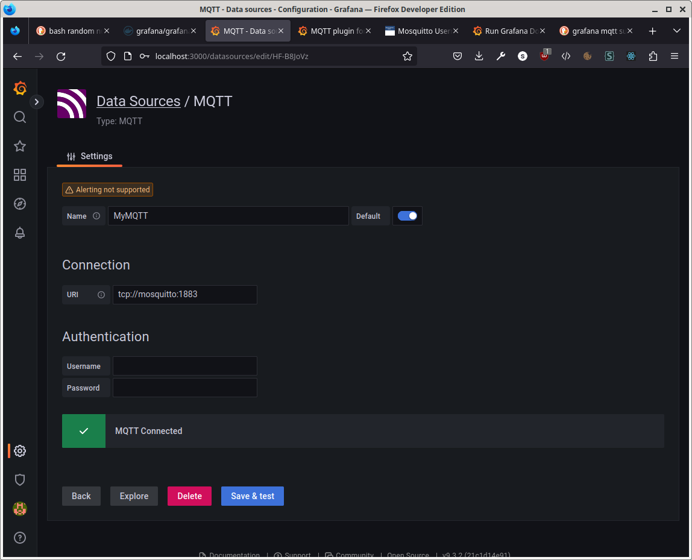
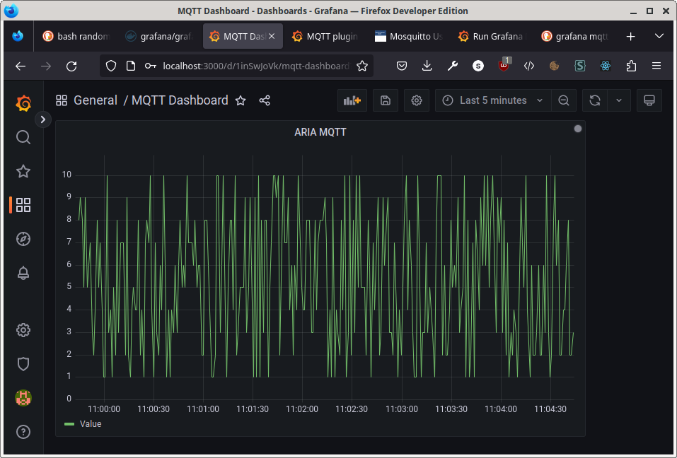

# Reads

Install MQTT Broker as Docker Machine

docker-compose up 

# Install Clients locally

sudo apt-get install mosquitto-clients

# Test

## Subscribe to a topic in Terminal 1

mosquitto_sub -v -t 'test/topic'

## Publish messages on another Terminal

mosquitto_pub -t 'test/topic' -m 'helloWorld'

## Publish in a loop

while true; do mosquitto_pub -t aria -m $((1 + RANDOM % 10)) -u aria -P aria; sleep 1; done


# Grafana

* install locally: https://grafana.com/docs/grafana/latest/setup-grafana/installation/debian/

* as of January 2023, better install fixed (older) version to prevent errors like...:

sudo apt-get install -y adduser libfontconfig1
wget https://dl.grafana.com/oss/release/grafana_9.1.2_amd64.deb
sudo dpkg -i grafana_9.1.2_amd64.deb

* install mqtt plugin: 

	```bash
	docker exec mosquitto-mqtt_grafana_1 sh -c "grafana-cli plugins install grafana-mqtt-datasource"
	```

* open http://localhost:3000

* login with admin:admin, and then setup a new admin password (and remember it)

* setup data source:

	1. go to Grafana Settings (gear wheel icon bottom left)
	2. go to Data Sources, add MQTT Data Source...
	2. enter mosquitto-mqqt broker hostname (as in docker-compose file), empty username and password
	
	3.

* add new dashboard
	- new panel
	- using mqtt data source 

	